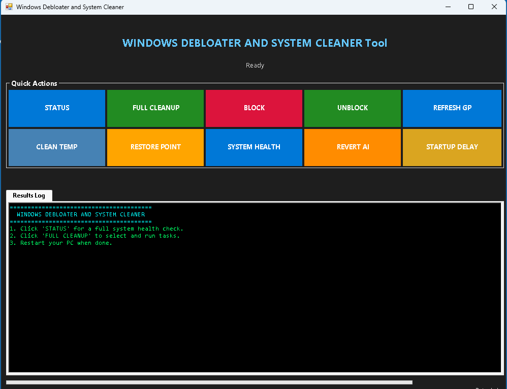

# Windows Debloater and System Cleaner
  
> **1-click PowerShell GUI** removes OneDrive/Xbox/Copilot bloat, disables 	elemetry services, applies privacy registry, Group Policy refresh, cleans 	emp — live status GUI.

## Download (EXE, no PS1 needed)
**Releases** → Windows Debloater.exe gear+broom 1024 icon — Right-click → **Run as Administrator**.

## What it does
- Disables telemetry / telemetry services
- Removes bundled apps (OneDrive, Xbox, etc.)
- Applies registry privacy settings
- Updates Group Policy / refreshes settings
- Cleans up temp files
- Shows live status in a unified GUI

## Requirements
- Windows 10/11
- Administrator rights (#Requires -RunAsAdministrator)
- PowerShell 5.1+

## Usage
Right-click Windows Debloater.exe → **Run as Administrator**
# or PS1
.\Windows-Debloater-and-System-Cleaner.ps1"

## License
MIT License — use, modify, and distribute freely. Original work by author; AI-assisted development.
